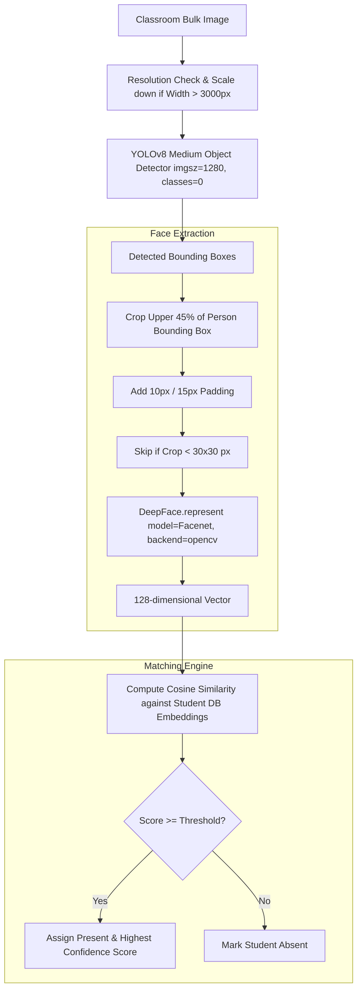

# AI & Computer Vision Engine

## Pipeline Overview

The computer vision subsystem ([ai/detector.py](file:///Users/surajjaiswal/SmartAttend-main_sujal/ai/detector.py) and [ai/recognizer.py](file:///Users/surajjaiswal/SmartAttend-main_sujal/ai/recognizer.py)) performs object detection, head cropping, face embedding extraction, and cosine similarity matching.

## Core Modules & Functions

### 1. Model Initialization ([ai/detector.py](file:///Users/surajjaiswal/SmartAttend-main_sujal/ai/detector.py#L9))
- `_get_yolo_model()`: Lazy-loads and caches `yolov8m.pt` (YOLOv8 Medium) model into a module-level variable `_yolo_model` to prevent memory thrashing on HTTP requests.

### 2. Face Detection & Encoding ([ai/detector.py](file:///Users/surajjaiswal/SmartAttend-main_sujal/ai/detector.py#L20))
- `detect_and_encode_faces(image_path, deep_scan=False)`:
  1. Reads image via `cv2.imread()`.
  2. Resizes image preserving aspect ratio if `width > 3000px` (`scale = 3000 / width`).
  3. Executes YOLO detection:
     - `conf_thresh`: `0.20` standard scan, `0.15` deep scan.
     - `imgsz`: `1280` (High-res for distant faces).
     - `iou`: `0.45` (Crowd non-maximum suppression).
     - `classes`: `[0]` (Person class only).
  4. Rescales coordinates `(x1, y1, x2, y2)` back to original image dimensions.
  5. Calculates upper 45% head region: `head_y2 = y1 + int(box_h * 0.45)` if `box_h > 40` else `y2`.
  6. Applies padding (`10px` standard, `15px` deep scan) and filters crops `< 30x30` pixels.
  7. Extracts 128-dim vector using `DeepFace.represent(face_crop, model_name='Facenet', enforce_detection=False, detector_backend='opencv')`.
  8. Returns list of 128-element float vectors.

### 3. Face Matching Logic ([ai/detector.py](file:///Users/surajjaiswal/SmartAttend-main_sujal/ai/detector.py#L109))
- `cosine_similarity(a, b)`:
  $$\text{Similarity} = \frac{a \cdot b}{\|a\| \|b\|}$$
- `match_face_to_students(face_encoding, students, threshold=0.6)`:
  1. Iterates over target students and their stored encodings (`student.get_encoding()`).
  2. Computes cosine similarity between input encoding and every stored vector for each student.
  3. Identifies the maximum similarity score.
  4. Returns `(student, best_score)` if `best_score >= threshold` else `(None, best_score)`.

### 4. High-Level Recognition Routines ([ai/recognizer.py](file:///Users/surajjaiswal/SmartAttend-main_sujal/ai/recognizer.py))
- `process_attendance(image_paths, students, threshold=0.6, deep_scan=False)`:
  - `effective_threshold`: `0.65` if `deep_scan` else `threshold`.
  - Iterates over all uploaded classroom image paths.
  - Matches detected faces to student database.
  - Updates `results[student.id]` with highest confidence score across all uploaded photos.
- `generate_face_embeddings(image_paths)`:
  - Extracts face embeddings from student profile training photos (caps at top 2 faces per image). Returns list of embeddings to append to student's profile.

## Fallback Mechanism
If `deepface` or dependencies fail to import during standard dev without GPU:
`detect_and_encode_faces()` captures `ImportError` and returns a deterministic mock dataset using Python `random.gauss(0, 1)` seeded by image path hash.
