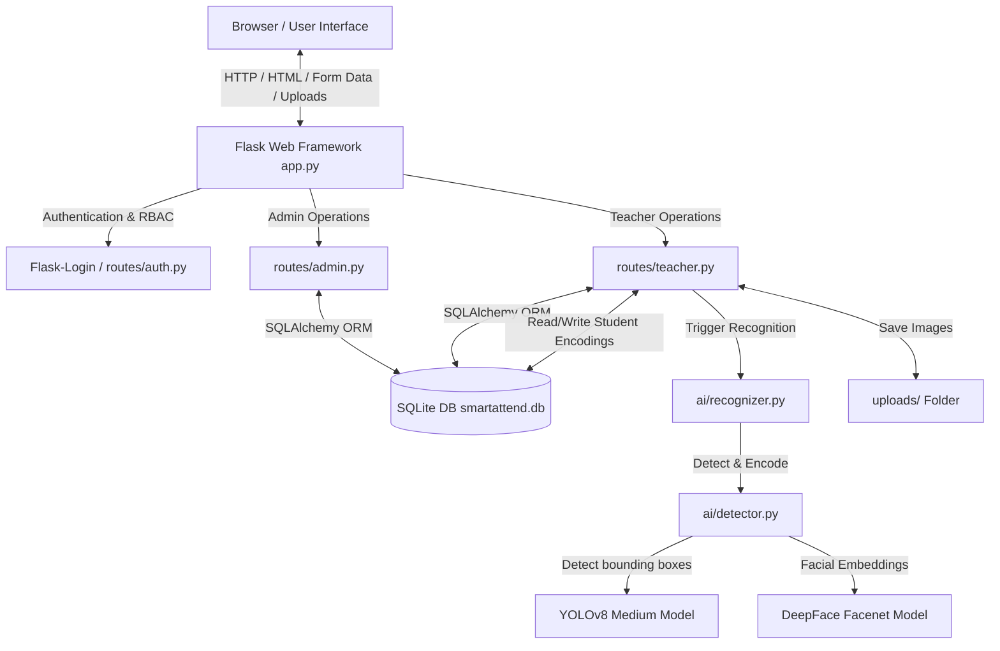

# Architecture & System Overview

## System Architecture

SmartAttend utilizes a classic Flask Model-View-Controller (MVC) architecture with an integrated Deep Learning computer vision pipeline.



## Core Technology Stack

- **Language & Framework**: Python 3.x, Flask 3.0.0
- **Database & ORM**: SQLite, Flask-SQLAlchemy 3.1.1
- **Session & Auth**: Flask-Login 0.6.3, Werkzeug password hashing
- **Computer Vision & AI**: Ultralytics YOLOv8 Medium (`yolov8m.pt`), DeepFace 0.0.x with Facenet backbone, OpenCV (`opencv-python`), NumPy
- **Data Import/Export**: Pandas, OpenPyXL (Excel), CSV engine
- **Frontend Engine**: Jinja2 Templates, HTML5/Vanilla CSS3 (Glassmorphism & CSS Variables), Vanilla JavaScript

## Component Directory Map

```
SmartAttend-main_sujal/
├── app.py                   # Application factory, global contexts, route registration, DB seeding
├── config.py                # Configuration classes (SECRET_KEY, SQLALCHEMY_DATABASE_URI, UPLOAD_FOLDER)
├── extensions.py            # Singleton extensions (db = SQLAlchemy(), login_manager = LoginManager())
├── models.py                # Database models (User, Department, Class, Subject, Student, AttendanceRecord, ApprovalRequest, DiscrepancyReport)
├── requirements.txt         # Core dependencies
├── test_accuracy.py         # Offline CLI accuracy test script for YOLO & DeepFace
├── ai/                      # Computer vision pipeline
│   ├── detector.py          # Lazy-loaded YOLOv8 + DeepFace representation + Cosine distance matcher
│   └── recognizer.py        # Multi-image batch attendance processor & face embedding generator
├── routes/                  # Blueprint controllers
│   ├── admin.py             # Administrative endpoints (Faculty management, approvals, system stats)
│   ├── auth.py              # Auth endpoints (Login, registration, logout)
│   └── teacher.py           # Teacher endpoints (Classes, student enrollment, photo training, attendance marking)
└── templates/               # Jinja2 HTML templates
    ├── base.html            # Core layout wrapper (Sidebar, Navigation, Top Bar, Toast Alerts)
    ├── admin/               # Administrative templates (dashboard, approvals, staff_log, analytics, settings)
    ├── auth/                # Auth templates (login, register)
    └── teacher/             # Teacher templates (dashboard, classes, lectures, mark_attendance, records, monthly_report)
```

## Key Application Entry Points

1. `app.py:create_app()`: Application factory initializes Flask, loads `Config`, sets up uploads directory, binds `db` and `login_manager`, registers blueprints (`auth_bp`, `admin_bp`, `teacher_bp`), defines context processor `inject_globals()`, and invokes `db.create_all()` and `seed_demo_data()`.
2. `app.py:seed_demo_data()`: Idempotently seeds default admin user (`username='utkarshyadav29'`, `password='Rgi@best'`).
3. Routing Root (`/`): Evaluates `current_user.is_authenticated` and redirects admins to `admin.dashboard`, teachers to `teacher.dashboard`, and unauthenticated users to `auth.login`.
