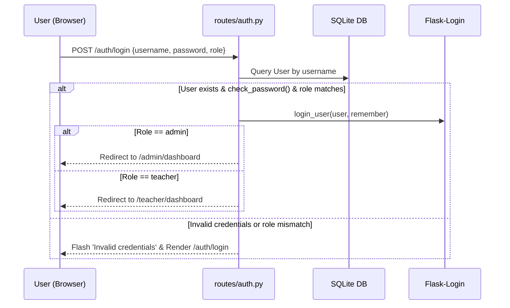

# Authentication & Authorization

## Overview

SmartAttend relies on **Flask-Login** for session management and standard **Werkzeug security** for password hashing (`pbkdf2:sha256` or default Werkzeug method). It features strict Role-Based Access Control (RBAC) separating `admin` and `teacher` capabilities.

## User Roles & Credentials

1. **Admin (`role='admin'`)**
   - Initialized via master seed in `app.py:seed_demo_data()` (`username='utkarshyadav29'`, `password='Rgi@best'`).
   - Access to full system settings, department/class/subject deletion, teacher account approval, access request review, and global analytics.
2. **Teacher (`role='teacher'`)**
   - Self-registers via `/auth/register`. Created with `is_active_account=False` and `department='Pending'`.
   - Cannot manage attendance until account is approved by Admin (`is_active_account=True`).
   - Manages assigned subjects, class rosters, student photo enrollments, AI attendance processing, and manual overrides.

## Route Security Decorators ([routes/admin.py](file:///Users/surajjaiswal/SmartAttend-main_sujal/routes/admin.py#L11), [routes/teacher.py](file:///Users/surajjaiswal/SmartAttend-main_sujal/routes/teacher.py#L13))

- `@admin_required`:
  ```python
  def admin_required(f):
      @wraps(f)
      def decorated(*args, **kwargs):
          if not current_user.is_authenticated or current_user.role != 'admin':
              return redirect(url_for('auth.login'))
          return f(*args, **kwargs)
      return decorated
  ```
- `@teacher_required`:
  ```python
  def teacher_required(f):
      @wraps(f)
      def decorated(*args, **kwargs):
          if not current_user.is_authenticated or current_user.role not in ('teacher', 'admin'):
              flash('Teacher access required.', 'error')
              return redirect(url_for('auth.login'))
          return f(*args, **kwargs)
      return decorated
  ```

## Authentication Flow Diagram



## Registration & Onboarding Lifecycle

1. **Teacher Registration (`POST /auth/register`)**:
   - Validates uniqueness of `username` and `email`.
   - Automatically formats `employee_id` (e.g. `TCH001`).
   - Sets `is_active_account=False`.
2. **Admin Approval (`POST /admin/approve_teacher/<id>` or `toggle_teacher_status/<id>`)**:
   - Admin sets `is_active_account=True`.
3. **Subject Access Request (`POST /teacher/request-access` or `/teacher/lectures`)**:
   - Teacher submits request for a subject/class with schedule notes.
   - Admin approves request via `/admin/approve_request/<id>`.
   - Subject access is granted to teacher upon approval.
