# Frontend & UI System

## Template Inheritance & Layout Hierarchy

```mermaid
graph TD
    Base[templates/base.html Top Bar, Sidebar, Dark Mode, Flash Messages]
    
    Base --> AdminDash[templates/admin/dashboard.html]
    Base --> AdminStaff[templates/admin/staff_log.html]
    Base --> AdminAppr[templates/admin/approvals.html]
    Base --> AdminAnalytics[templates/admin/analytics.html]
    Base --> AdminSettings[templates/admin/settings.html]
    
    Base --> TeacherDash[templates/teacher/dashboard.html]
    Base --> TeacherClasses[templates/teacher/classes.html]
    Base --> TeacherLectures[templates/teacher/lectures.html]
    Base --> TeacherMark[templates/teacher/mark_attendance.html]
    Base --> TeacherRec[templates/teacher/records.html]
    Base --> TeacherMonthly[templates/teacher/monthly_report.html]
    
    Base --> AuthLogin[templates/auth/login.html]
    Base --> AuthRegister[templates/auth/register.html]
```

## Core Design System & Styling Architecture

- **Theme Engine**: Modern glassmorphism dark/light UI implemented directly in `templates/base.html` via CSS custom variables (`--bg-primary`, `--bg-card`, `--text-primary`, `--accent-color`).
- **Typography**: Inter / System Sans-Serif font stack with dynamic sizing.
- **Component Patterns**:
  - **Sidebar Navigation**: Role-aware sidebar switching between Admin options (Dashboard, Staff Log, Approvals, Analytics, Settings) and Teacher options (Dashboard, My Classes, Schedule Lectures, Mark Attendance, Records, Monthly Report).
  - **Top Bar**: Search bar, pending approval notification badges (`ctx['pending_approvals_count']`), date display, and user profile dropdown.
  - **Stat Cards**: Dynamic KPIs with trend indicators (Total Students, Active Classes, Pending Requests, Today's Attendance Rate).
  - **Data Tables**: Action buttons (Edit, Delete, Photo Enroll), status pills (`Present` = green, `Absent` = red, `Pending` = yellow).
  - **Interactive Modals**: Add Student, Edit Student, CSV Import, Add Department, Assign Teacher.

## JavaScript & Client-Side Logic

1. **Chart Visualizations**: Rendered via Chart.js embedded in templates (`weekly` attendance bar/line charts and monthly rate comparisons).
2. **AJAX API Calls**:
   - `fetch('/teacher/classes/upload-photo/' + studentId)`: Drag-and-drop asynchronous training photo upload.
   - `fetch('/teacher/api/mark-attendance-manual')`: Real-time toggle of student attendance status without full page refresh.
   - `fetch('/teacher/finalize-attendance')`: Finalize session lock confirmation.
   - `fetch('/teacher/delete-session')`: Asynchronous lecture session deletion.
3. **Dynamic Filtering**: Client-side Search filter across student rosters and staff management logs.
